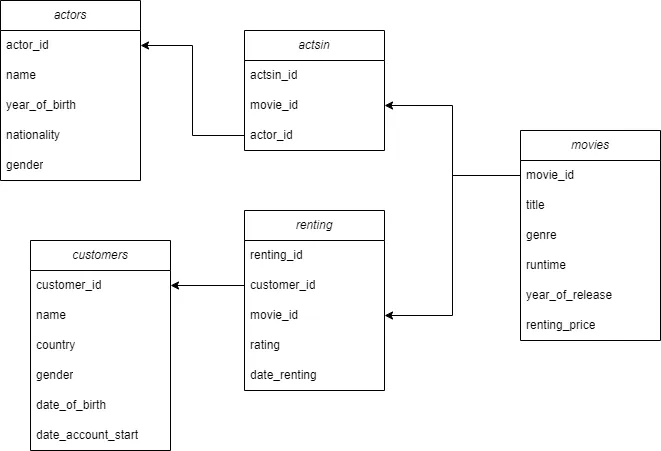

---
title: "MovieNow: Fictitious Movie Rental Analysis"
date: 2024-02-16
tags: ["SQL", "EDA"]

![Movie Rental][def]  

[def]: thumb-MovieNow.jpg "Photo by [Sean Benesh](https://unsplash.com/@seanbenesh?utm_content=creditCopyText&utm_medium=referral&utm_source=unsplash) on [Unsplash](https://unsplash.com/photos/grayscale-photo-of-books-on-shelves-6Nbo9Pn0yJA?utm_content=creditCopyText&utm_medium=referral&utm_source=unsplash)"

### Introduction

Since I finished my thesis defense, I’ve been learning SQL, and I want to practice and implement my knowledge so that I won’t end up in the [Tutorial Hell Loop](https://www.urbandictionary.com/define.php?term=Tutorial+Hell). This so-called project aims to explore the dataset of a fictitious online movie rental named “MovieNow”. The dataset was obtained from the [Data-Driven Decision-Making course in Datacamp](https://app.datacamp.com/learn/courses/data-driven-decision-making-in-sql) materials. In this project, I utilized SQL to gain valuable insight regarding users’ preferences about movies and actors, trends and patterns from movie rental, and other key metrics.

I created a [SQLite database named MovieNow that runs locally using Jupyter Notebook in Visual Studio Code](https://medium.com/@mutiaraa/learned-to-use-sqlite-5576b1c77ed7). The dataset consists of five tables with each column type as below, assuming that the dataset was already cleaned and processed. For more details about the primary key and other constraints, [you can read this](https://github.com/alyamutiara/DataLearning-Roadmap/blob/main/Project/SQL%20-%20Online%20Rental%20Movies/MovieNow-sqlite.sql).

Then I tried to find some insight that could be extracted from the dataset. To get a kickoff idea about the dataset, I proposed several questions I thought up and figured out using SQL queries.